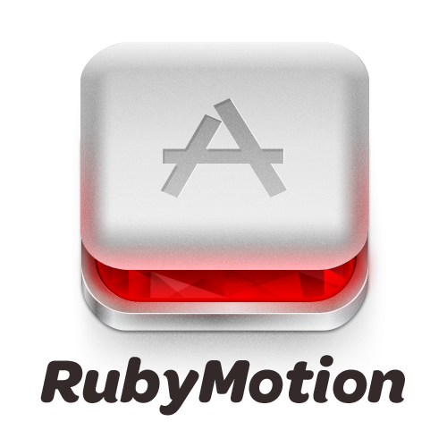

!SLIDE 
# RubyMotion the First Week Impressions

!SLIDE

## About

* Francis Chong [@siuying](http://twitter.com/siuying)
* [Ignition Soft](http://ignition.hk)

!SLIDE

## Agenda

1. The Basic
2. The Good
3. The Gotcha

!SLIDE center

!SLIDE huge
# The Basic

!SLIDE
## Ruby on iOS

!SLIDE 
# MacRuby + GC +  Toolchain

!SLIDE bigger
# MacRuby

!SLIDE 
## An implementation of Ruby 1.9 based on Mac OS X core technologies

!SLIDE 
- Objective-C Runtime
- Foundation
- ICU
- GCD

!SLIDE 
## Statically compiled into native code  via LLVM

!SLIDE bigger
# Toolchain

!SLIDE
## Interactive console (REPL)

!SLIDE 
## Raketask

!SLIDE command fullscreentext

    $ rake --tasks
    rake archive              # Create archives for everything
    rake archive:development  # Create an .ipa archive for development
    rake archive:release      # Create an .ipa for release (AppStore)
    rake build                # Build everything
    rake build:device         # Build the device version
    rake build:simulator      # Build the simulator version
    rake clean                # Clear build objects
    rake config               # Show project config
    rake ctags                # Generate ctags
    rake default              # Build the project, then run the simulator
    rake device               # Deploy on the device
    rake simulator            # Run the simulator
    rake spec                 # Run specs

!SLIDE 
## Cocoapods Integration

!SLIDE fullscreentext
    @@@ ruby
    $:.unshift("/Library/RubyMotion/lib")
    require 'motion/project'
    require 'motion-cocoapods'

    Motion::Project::App.setup do |app|
      app.name = 'App'
      app.pods do
        dependency 'ASIHTTPRequest'
        dependency 'NanoStore'
      end
    end

!SLIDE 
# Let's Code
